# DenseMatrixMultiplication

# Problem Overview

This problem solved to understand underlying technology of GPUs better and become familiar of CUDA interface. Take into account that used method may not be the optimum one.

For every possible 5x5 matrix combinations in a 15x15 pixel 16-bit grayscale image (will be considered as 15x15 matrix A), take square of each 5x5 matrix and then write resulted matrix into corresponding locations of output image (will be considered as matrix C). 

Figure 1 shows an example 5x5 matrix combination in matrix A, square of this example matrix needs to be written in corresponding positions of matrix C.

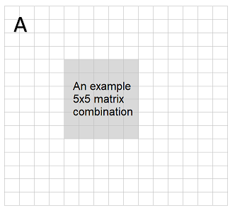

**Figure 1**: Input matrix A

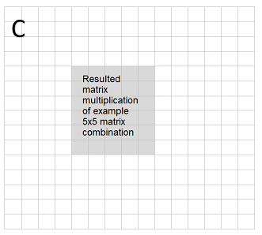

**Figure 2**: Output matrix C

--- 
Usually this kind of problems encountered in signal processing domain as processing an image, audio or any other signal. Most filtering techniques use a local window that slides onto a large matrix and filters it with predefined calculation steps.

This problem can benefit from parallelization, CUDA architecture used to solve it in this project.

# Designing the Solution
The problem can be solved by dividing it into pieces. There will be different 5x15 frames to cover whole 15x15 matrix. **Figure 3** shows some of the frames, 11 frames would be enough for this solution considering all combinations.

---
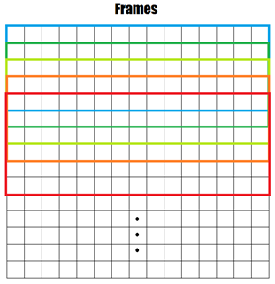

**Figure 3**: There are 11 many 5x15 frames to cover whole 15x15 matrix

---

Each frame contains 5x5 windows that each of them differs by sliding them by one. **Figure 4** shows some of the window combinations, there should be 11 windows necessary to cover a frame.

---

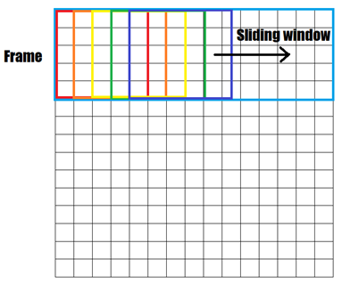

**Figure 4**: 15x15 matrix divided into eleven many frames. Windows slide in each frame

---
If this problem was solved in serial manner, single sliding window from beginning to end would be enough. But in this project each piece can be distributed among the threads to benefit from parallelization.

With CUDA architecture processing the matrix can be distributed to blocks and threads. Each frame can be processed by a block of threads and each thread can be responsible to process a window. Therefore, in this solution, there will 11 many blocks match with each frame and each block contain eleven many threads inside.

As **Figure 3** shows overlapped frames which makes harder to design a solution. Therefore, there will be one kernel executes at a time to process a frame. Each kernel executes frame calculations in sequential manner to avoid accessing overlapped memory regions at the same time. But all threads in the block executing concurrently to process each window in the frame.

When solving the problem, the essential part emerged on accessing the common memory regions for read/write operations. At the beginning, solution designed by executing all the frames and windows concurrently, but the blocks don’t write to the global memory deterministically without synchronizing them. For example, when a thread finishes its own window calculation, it should add resulted matrix to the global 15x15 matrix. This write access is problematic since block synchronization should be considered. There are memory fence concepts in CUDA which makes visible a memory operation to other threads before moving on, but it doesn’t solve this synchronization problem. Therefore, it is decided to move further with executing each kernel in sequential order to avoid constructing a system with semaphores and complicating the problem. 

To generate input matrix A, *rand()* function used with seed of value 5. Problem defined by giving example of 16-bit grayscale image and each pixel can take intensity value from 0 to 65535 in a grayscale image format. Square of a pixel intensity value may exceed 65535 and result value needs to be limited to 65535 for such cases, hence generated input matrix A values limited by 63 at the initial to observe calculations better. 

# Calculation Steps

To observe steps of the solution easier, let’s assume input matrix A all filled with ones initially which is shown in Figure 3. So, square of 5x5 window will be resulted a 5x5 matrix that all elements are valued 5. Each thread adds its resulted 5x5 matrix to corresponding locations in output matrix C cumulatively.

---
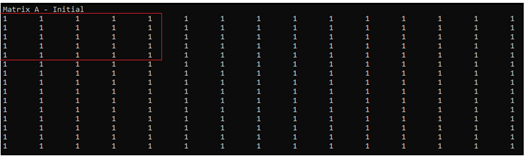

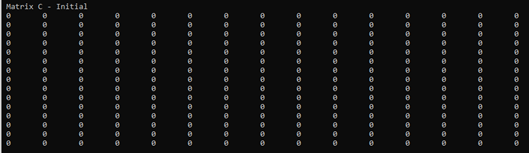

**Figure 5**: Input matrix A with an example window and output matrix C initially

---

After executing frame 0’s calculation for each window, result matrix C will be written by each thread cumulatively. Each thread accesses to memory and writes its own result to the result matrix C. **Figure 6** shows the resulted matrix C, each thread writes result 5x5 matrix to corresponding locations. Because most of the windows overlapped in center of the frame, centered windows have high numerical values than their border counterparts.

---
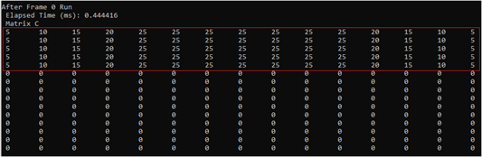

**Figure 6**: Result matrix C written by each thread after first frame calculation run. 

---

Responsible area of first frame shown in red.
After the second frame’s calculation its threads add their own results to result matrix C. **Figure 7** shows that values of overlapped sections in the frames increased cumulatively.
 
 ---
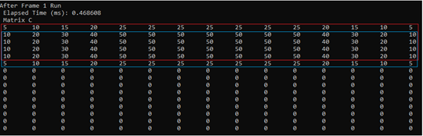

**Figure 7**: Sections of first frame (shown in red) and second frame (shown in blue). 

---

Frame 11’s calculation ends the calculations steps. Final scene shown in **Figure 8**, it is observed that most of the windows overlapped in center of the matrix.
 
---
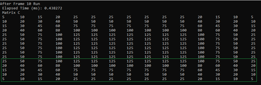

**Figure 8**: Scene at the end of the calculations. Frames 11’s section shown in green.

---

Calculations done by Intel i7-9700K and NVIDIA RTX 2060. Hardware is not that important but added to give an insight.

# Solution Without Shared Memory

Problem solved by using only global memory of the GPU at first. Both input matrix A and output matrix C allocated in global device memory and each thread accessed from it.
Flow of the kernel function can be seen in **Figure 9**:

1.	Firstly thread copies its corresponding window from global memory to its own for both Matrix A and Matrix C. 
2.	Then it calculates square of the window matrix in a for loop.
3.	Thread waits other threads to synchronize before writing its own result to the global memory.
4.	Thread adds local resulted window matrix corresponding window location in Matrix C without disrupting its existing values. This operation should be done atomically because other threads may access the same location at the same time. 
 
---
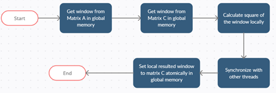

**Figure 9**: Flow of kernel function in solution which doesn’t apply shared memory

---

**Table 1** shows execution time of kernel function for calculating its corresponding frame.

| Frame Number 	                        | Time(ms) 	|
|--------------	                        |----------	|
| 0            	                        | 0.444416  |
| 1            	                        | 0.468608  |
| 2            	                        | 0.450464  |
| 3            	                        | 0.480352  |
| 4            	                        | 0.438496  |
| 5            	                        | 1.070016  |
| 6            	                        | 0.438368  |
| 7            	                        | 0.442368  |
| 8            	                        | 0.441632  |
| 9            	                        | 0.444576  |
| 10                                    | 0.438272  |
| Total Time (ms)                       | 5.557568  |
| Average Time For a Frame(ms)          | 0.505233  |

**Table 1**: Execution time of each kernel for corresponding frames

# Solution With Shared Memory

This solution differs from previous one by copying input windows from global memory to shared memory, then accessing input matrices only from shared memory [1]. 

---
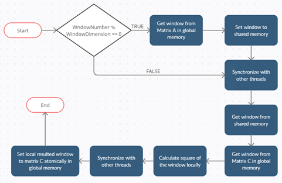

**Figure 10**: Flow of kernel function in solution which applies shared memory

---
**Figure 10** shows flow of the kernel function as follows:
1.	Threads should copy the content of global memory to shared memory for accessing them faster in the further steps. Because the windows are overlapping each other, it would be easy if only a small number of threads copy the content. Therefore, as Figure 10 shows only the non-overlapping content copied to shared memory in the frame depending on thread number which is same as windowNumber. With this approach there will be no atomic operation necessity occurs.
2.	Synchronize with other threads to ensure shared memory write operations have completed.
3.	Thread copies related input matrix window from shared memory and copies window matrix C from global memory.
4.	It calculates square of the window matrix in a for loop.
5.	Thread waits other threads to synchronize before writing its own result to the global memory.
6.	Thread writes its own result to the matrix C atomically.

---
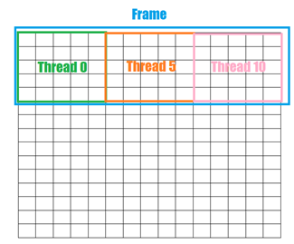

**Figure 11**: Corresponding windows and threads showed in colored. Only non-overlapping threads copy the content from global memory to shared memory in a frame. 

---

**Table 2** shows execution times for each kernel. Surprisingly results observed worse than previous approach. Copying content from shared memory creates a overhead than accessing existing global memory. Also, all other threads wait for shared memory copy process completion before accessing it. Therefore, speed up of accessing the shared memory for calculations doesn’t compensate the overhead of initial global memory to shared memory copy. 
I think this result correlated with scale of the problem also. For this scale of the problem shared memory doesn’t speed up as necessary but only creates overhead. For a problem that needs much more memory access would benefit from shared memory better. 

| Frame Number 	                        | Time(ms) 	|
|--------------	                        |----------	|
| 0            	                        |  0.554592 |
| 1            	                        |  0.562240 |
| 2            	                        |  0.584736 |
| 3            	                        |  0.575488 |
| 4            	                        |  1.177600 |
| 5            	                        |  0.582368 |
| 6            	                        |  0.573696 |
| 7            	                        |  1.362240 |
| 8            	                        |  0.579360 |
| 9            	                        |  1.279552 |
| 10                                    |  0.660128 |
| Total Time (ms)                       |  8.492    |
| Average Time For a Frame(ms)          |  0.772    |

**Table 2**: Execution time of each kernel for corresponding frames with using shared memory

# References
1.	CUDA C Programming Guide, 3.2.3 Shared Memory
